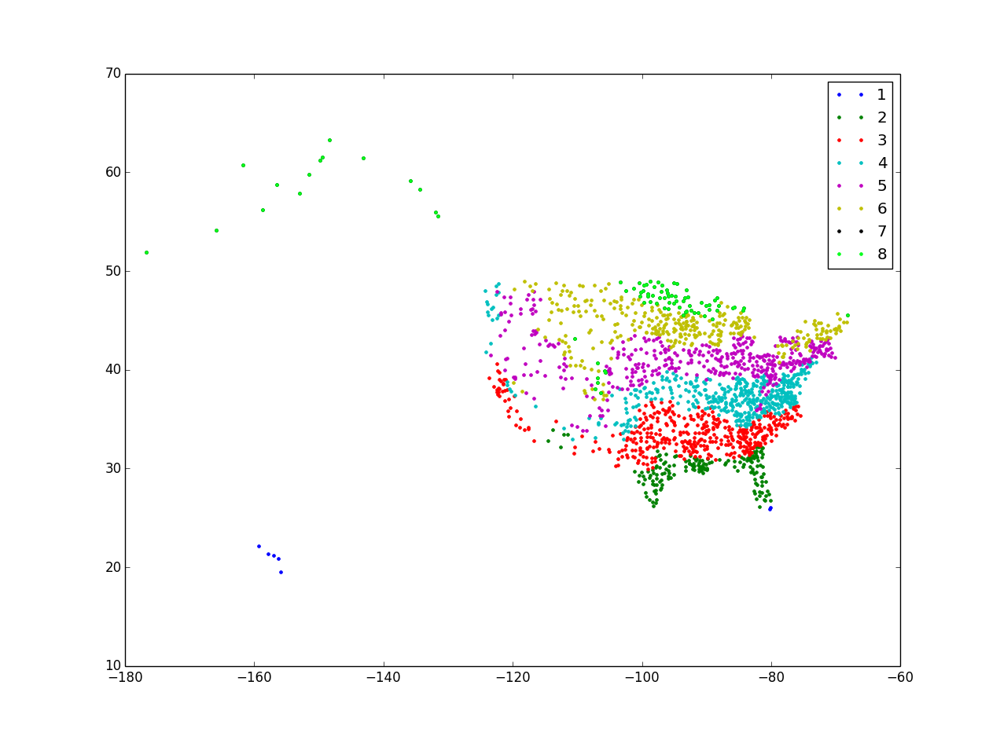

#2015-03-06 Ashare Climate Zone Project

##What is Ashare R-value Climate Zone

ASHRAE R-Value Climate Zone Map Building codes require a structure to meet certain R-values to achieve a specific level of efficiency. The climate zone plays a big role in determining what the minimum R-value has to be for a specific region. Additionally, each state or local code body may be at differing levels of adoption of energy codes.

Reference: [http://www.atlasroofing.com/sustainability/climate-zones-map](http://www.atlasroofing.com/sustainability/climate-zones-map)

##What I want to approach

On this website [http://en.openei.org/wiki/ASHRAE\\_Climat\\_Zones](http://en.openei.org/wiki/ASHRAE_Climate_Zones) We have the Climate Zone information for 3141 Counties all over US. I want to see how these climate zone point locate on map. So we have to look up the lat, long of every climate zone point in zip_code_database.csv.

